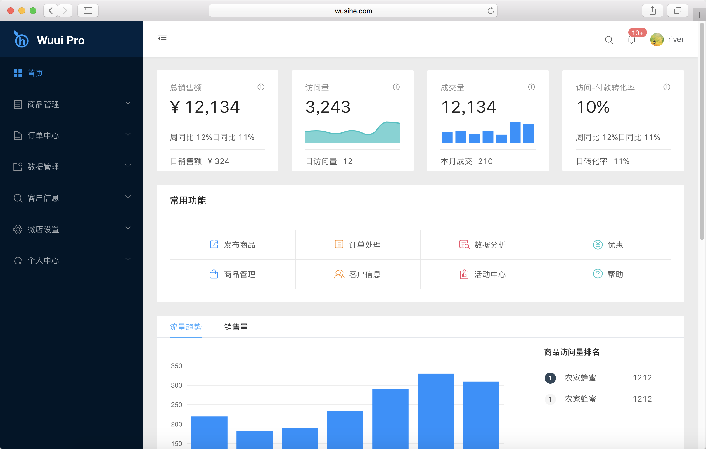

<wu-row>
 <wu-col :xs="24" :sm="24" :md="12" :lg="12" :xl="12">
 	
 </wu-col>
 <wu-col :xs="24" :sm="24" :md="12" :lg="12" :xl="12" class="start-right">
	 <h1 align="center">Wuui Pro</h1>
	 

	 	
开箱即用的中台前端/设计解决方案。

	 	

	 		<a href="http://wusihe.com/pro/#/home">
				<wu-button size="large" type="primary">Demo预览</wu-button>
			</a>
			<a href="https://github.com/wsihe/wuui-pro">
				<wu-button size="large" >GitHub</wu-button>
			</a>
	 

	 

 </wu-col>
</wu-row>

